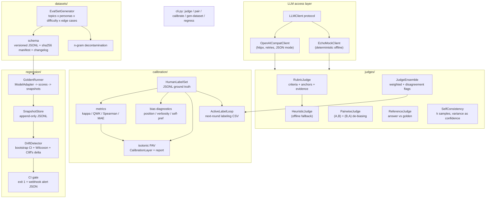

# VerdictAI

[](brag-output/brag.mp4)


**LLM-as-Judge with human calibration, eval dataset generation, and regression detection.**

VerdictAI is a production-shaped evaluation harness for LLM systems: it judges model
outputs with rubric-decomposed LLM judges (plus a deterministic offline fallback),
measures how well those judges agree with humans, diagnoses the judge's systematic
biases, calibrates judge scores onto the human scale, generates versioned golden
datasets with leakage control, and gates deploys on statistically defensible
regression evidence.

Everything runs **fully offline by default** — deterministic mock clients, heuristic
judges, and hand-rolled statistics (no scipy/sklearn/torch) — and swaps to any
OpenAI-compatible endpoint with one environment variable.

```bash
pip install -e .
python -m pytest -q        # 100+ offline tests, no network, no API key
verdict judge --prompt "Answer in JSON: 2+2?" --response '{"answer": "4"}'
```

## 🟢 New to AI? Read this first

**The problem, in human terms.** Companies now use an AI model to grade other AI models ("rate this answer 1-5 for helpfulness"). But that grader is *itself* a fallible machine: it might prefer the first answer it reads, favor longer answers, or grade its own writing more kindly — and nobody checks the grader's work.

**What this project does.** VerdictAI is the quality-control lab for AI answers, in four steps:

1. **Grade it** — AI answers are scored against a written rubric (like a school marking scheme: "accuracy 0-5, evidence 0-5, tone 0-5") with quoted proof for each score. For "which answer is better?" questions, it grades the pair in *both* orders and de-biases the result — if the verdict flips depending on which answer was read first, that **position bias** is caught and measured.
2. **Check the grader against humans** — humans grade a sample too. VerdictAI computes how much the AI grader agrees with humans *beyond luck* (Cohen's kappa), finds its tics (does it just like long answers? its own writing style?), and then **re-curves** its scores onto the human scale using isotonic regression — the same idea as a teacher curving exam marks, done with a provably-correct algorithm (PAV) implemented from scratch.
3. **Make better exam questions** — an automated generator builds golden test sets with real variety (topics × personas × difficulty × nasty edge cases like hidden instructions and unicode tricks), tracks that nothing is missed on a coverage matrix, and strips anything too similar to training data (decontamination) so the exam can't be "memorised".
4. **Sound the alarm** — every model version's exam scores are snapshotted. When a new version arrives, paired bootstrap confidence intervals decide whether a score drop is a *real regression or noise*; the CI gate fails the build on real regressions and stays silent on noise.

**Measured outcomes:** 177 automated tests pass offline in under two seconds — including hand-computed statistics fixtures (kappa = 0.5 on a worked example, quadratic weighted kappa = 2/7, PAV interpolation 2.5 → 3.75), planted position-bias detected and corrected, bootstrap CIs that correctly flag planted degradations and pass seeded noise, and end-to-end CLI gate runs with correct exit codes. Nothing is trusted without a number.

---

## Why this exists

Teams increasingly ship LLM features gated by "the judge model said it's fine." That
judge is itself a model with biases, drift, and no calibration guarantee. VerdictAI
treats the judge as a first-class measured component:

1. **Judge** responses with rubrics, pairwise double-order comparisons, and reference
   matching.
2. **Calibrate** the judge against a small human-labeled set and quantify agreement
   (kappa, QWK, Spearman, MAE) before and after isotonic calibration.
3. **Diagnose bias** — position, verbosity, self-preference — with targeted statistics.
4. **Generate** golden datasets that cover a topic × persona × difficulty × edge-case
   grid, decontaminated against your corpus, versioned with sha256 manifests.
5. **Gate** releases on paired bootstrap CIs + effect sizes, not vibes.

## Architecture



### Module map

| Module | What it does |
|---|---|
| `llm.py` | `LLMClient` protocol; OpenAI-compatible client (retries, JSON mode); `EchoMockClient` deterministic offline mock |
| `judges/rubric.py` | `RubricJudge` (LLM, per-criterion score + evidence quote + rationale, weighted overall) and `HeuristicJudge` (deterministic keyword/length/format signals) |
| `judges/pairwise.py` | `PairwiseJudge` — both presentation orders, de-biased aggregate, `position_bias_rate` |
| `judges/reference.py` | `ReferenceJudge` — token-F1 vs golden answer (heuristic) or LLM-scored |
| `judges/ensemble.py` | `JudgeEnsemble` — weighted judges, disagreement flagging for human review |
| `judges/consistency.py` | `SelfConsistency` — k samples at temperature, majority verdict, variance as confidence |
| `calibration/labels.py` | `HumanLabelSet` JSONL loader with per-line validation |
| `calibration/metrics.py` | Cohen's kappa, quadratic weighted kappa, tie-aware Spearman, MAE, within-1 accuracy — pure numpy, each with a hand-worked docstring example |
| `calibration/bias.py` | position-bias rate, verbosity regression + permutation test, self-preference flags |
| `calibration/isotonic.py` | PAV isotonic regression, `CalibrationLayer`, markdown calibration report |
| `calibration/active.py` | `ActiveLabelLoop` — prioritized labeling queue CSV |
| `datasets/generator.py` | `EvalSetGenerator` — coverage matrix, template bank / LLM path, decontamination |
| `datasets/schema.py` | versioned `EvalDataset`, validation, sha256 manifest, changelog |
| `regression/runner.py` | `ModelAdapter` protocol, `GoldenRunner`, append-only `SnapshotStore`, offline `OfflineReplayAdapter` |
| `regression/drift.py` | paired bootstrap CI, Wilcoxon signed-rank (exact small-n / normal + tie correction), Cliff's delta, `DriftDetector` |
| `regression/gate.py` | CI gate: exit codes, markdown summary, webhook-ready alert JSON |
| `service.py` | FastAPI eval-service: async eval runs, gate endpoint, HMAC-signed webhooks, API-key auth |

## Quickstart

```bash
pip install -e .
cp .env.example .env   # optional; everything works without it
```

**Score one response (offline):**

```bash
verdict judge --prompt "Summarize the ticket as bullets." \
              --response "- billing issue\n- high priority" \
              --reference "- billing issue\n- high priority"
```

**Pairwise with double-order de-biasing (offline echo mock):**

```bash
verdict pair --prompt "When is my refund processed?" \
             --response-a "Refunds post within 5 business days of return receipt." \
             --response-b "soon"
```

**Generate a versioned golden dataset:**

```bash
verdict gen-dataset --out datasets/ --version v1 --seed 42 \
    --topics "math-word-problems:reasoning,support-ticket-triage:classification" \
    --corpus corpus.txt --contamination-n 8
# -> dataset-v1.jsonl, manifest-v1.json (sha256), CHANGELOG.md entry
```

**Calibrate a judge against human labels:**

```bash
verdict calibrate --labels labels.jsonl --out calibration-report.md
```

`labels.jsonl` rows: `{"item_id", "judge_score", "human_score", "response_a", ...,
"meta": {"judge_family": ..., "response_a_family": ...}}`.

**Regression gate in CI:**

```bash
verdict regress --snapshots runs.jsonl --baseline v1 --candidate v2 \
                --threshold 0.05 --min-effect 0.1 --gate
# exit 1 on regression; prints markdown summary + alert JSON
```

Programmatic end-to-end (offline, no keys):

```python
import asyncio
from verdictai.datasets.generator import EvalSetGenerator, GeneratorConfig
from verdictai.datasets.schema import save_dataset
from verdictai.judges.reference import ReferenceJudge
from verdictai.regression.runner import GoldenRunner, OfflineReplayAdapter, SnapshotStore
from verdictai.regression.gate import run_gate

dataset = EvalSetGenerator(GeneratorConfig(version="v1", seed=42)).generate()
save_dataset(dataset, "datasets/")

store = SnapshotStore("runs.jsonl")
async def run_all():
    for quality, version in ((1.0, "baseline-v1"), (0.7, "candidate-v2")):
        adapter = OfflineReplayAdapter(dataset, quality=quality, model_version=version)
        await GoldenRunner(adapter, ReferenceJudge(), store).run(dataset)
asyncio.run(run_all())

gate = run_gate(store.latest("baseline-v1"), store.latest("candidate-v2"))
print(gate.report_markdown, gate.exit_code)
```

## Serve the gate (eval-service HTTP API)

The same harness is available over HTTP so CI systems and internal platforms
consume VerdictAI without shelling out to the CLI. Runs still execute fully
offline: candidates are the `replay`/`mock` adapters (no live model calls) and
the default judge is the deterministic reference judge.

```bash
pip install -e .                       # brings in fastapi + uvicorn
export VERDICTAI_API_KEYS="ci-key,platform-key"   # optional; unset = auth disabled
uvicorn verdictai.service:create_app --factory --port 8077
```

API keys arrive in the `X-VerdictAI-Key` header; the service stores only their
SHA-256 hashes and compares in constant time. `GET /health` never requires a
key. Requests may carry `X-Correlation-ID`; it is echoed on every response.

| Method | Path | What it does |
|---|---|---|
| `GET` | `/health` | liveness probe (no auth) |
| `POST` | `/v1/eval-runs` | submit an eval run: inline dataset JSONL **or** a registered dataset name, a `replay`/`mock` candidate adapter with params, and metadata (`model_version`, `triggered_by`). Returns `202` + `run_id`; the golden runner executes in a background thread |
| `GET` | `/v1/eval-runs/{run_id}` | status (`queued`/`running`/`succeeded`/`failed`) + metrics summary when done |
| `GET` | `/v1/eval-runs/{run_id}/report` | run report as JSON (default) or `?format=markdown`; once a gate has run it serves the gate report instead |
| `POST` | `/v1/eval-runs/{run_id}/gate` | gate this run as candidate against `{"baseline_run_id", "threshold", "min_effect"}`; returns `{passed, exit_code, verdict, evidence}` — `exit_code` mirrors `verdict regress --gate` |
| `POST` | `/v1/eval-runs/{run_id}/webhook` | register `{url, secret}`; on run completion the service POSTs the event JSON with `X-VerdictAI-Signature: sha256=<hex HMAC of the body>` (GitHub-style; verify over the raw bytes with your secret) |

```bash
RUN=$(curl -s -X POST localhost:8077/v1/eval-runs \
  -H "X-VerdictAI-Key: ci-key" -H "Content-Type: application/json" \
  -d '{
        "dataset": {"name": "golden-smoke"},
        "candidate": {"adapter": "replay",
                      "params": {"quality": 1.0, "model_version": "candidate-v2"}},
        "metadata": {"model_version": "candidate-v2", "triggered_by": "ci"}
      }' | python -c "import sys, json; print(json.load(sys.stdin)['run_id'])")

curl -s -H "X-VerdictAI-Key: ci-key" localhost:8077/v1/eval-runs/$RUN
curl -s -X POST -H "X-VerdictAI-Key: ci-key" \
     -d '{"baseline_run_id": "<baseline-run-id>", "threshold": 0.05}' \
     localhost:8077/v1/eval-runs/$RUN/gate
```

Datasets can be submitted inline (`"dataset": {"jsonl": "...", "version": "v1"}`) or
pre-registered at startup: `create_app(registered_datasets={"golden-smoke": dataset})`.
Run state lives in memory with a TTL (1 h) and a 100-run cap (oldest evicted) —
the service is a thin async skin over offline runs, not a run database.

## Design decisions (and their trade-offs)

**1. Pairwise judging runs both orders — (A,B) and (B,A).**
LLM judges are known to flip verdicts with presentation order (position bias; Zheng
et al. 2023, *Judging LLM-as-a-Judge*; Wang et al. 2023, *Large Language Models are
not Fair Evaluators*). VerdictAI scores `a` as the mean of the two binary verdicts
(win=1, loss=0, tie=0.5), so an order-flipped item lands at 0.5 instead of 0 or 1,
and `position_bias_rate` quantifies how often the judge flips at all.
*Trade-off:* 2x judge cost per comparison. Worth it: silent position bias
systematically distorts rankings in ways single-order averaging cannot see.

**2. Isotonic regression (PAV) over Platt scaling for calibration.**
Platt scaling fits one parametric sigmoid — it assumes the miscalibration has a
specific logistic shape and can only globally stretch/compress. Judge
miscalibration is messier but still monotone: saturation at 4–5, dead zones near 0,
kinks. PAV fits the optimal *monotone* step function with no shape assumption, in
O(n) with a stack, implemented by hand (see `calibration/isotonic.py`).
*Trade-off:* isotonic needs more labels and can overfit small sets (the monotonicity
prior is the regularizer); Platt is better below ~50 labels. The calibration report
prints before/after MAE so overfitting is visible, and out-of-range queries are
clamped with linear interpolation between fitted blocks.

**3. Bootstrap CI over a paired t-test for regression detection.**
Per-item score deltas are bounded (0–5), frequently bimodal (a changed prompt fails
a subset of items outright), and capability slices are small. The bootstrap
percentile CI over item-level paired deltas makes no normality assumption and
preserves pairing, which is where most of the variance reduction comes from.
*Trade-off:* percentile CIs undercover at very small n (< ~15 items); the Wilcoxon
signed-rank (exact for n ≤ 16) complements it, and the gate requires an effect-size
guard (see 5).

**4. Rubric decomposition with anchors and evidence.**
A single holistic "score 1-10" request is the noisiest way to use an LLM judge.
Decomposing into weighted criteria with 0–5 anchors, a required evidence quote, and
a one-line rationale (a) reduces variance by forcing the model to evaluate each
dimension separately, (b) makes verdicts auditable (the quote either supports the
score or it doesn't), and (c) lets the ensemble weight criteria explicitly.
*Trade-off:* more tokens per judgment and more parsing surface (mitigated by strict
payload validation and clamping).

**5. The gate requires a minimum effect size, not just a CI.**
On 5,000 items a statistically-clean mean shift of 0.01 will exclude zero — and
block your deploy for nothing. VerdictAI claims a regression only when the
bootstrap CI lower bound exceeds the threshold **and** the paired effect size
(Cliff's delta on deltas) clears a floor. *Trade-off:* a real-but-diffuse
micro-regression passes the gate; that's the correct default for CI noise floors.

**6. Known judge biases are measured, not just mentioned.**
- *Position bias* → double-order runs, `position_bias_rate` (Wang et al. 2023).
- *Verbosity bias* — judges prefer longer answers (Wu & Aji 2023) → OLS slope of
  judge score on response length with a seeded permutation p-value.
- *Self-preference* — models rate their own outputs higher (Panickssery et al. 2024)
  → flags items where the judge's model family matches one candidate's family and
  preferred it.

**7. Statistics by hand, no scipy/sklearn.**
Kappa, QWK, midrank Spearman, PAV, Wilcoxon (with tie correction), Cliff's delta and
the bootstrap are each ~20 lines, have hand-worked examples in their docstrings, and
are pinned by tests against those exact numbers. Small, auditable statistics beat
importing a numerical stack for six formulas — and keep the dependency surface
(hence supply-chain surface) minimal.

**8. Active labeling by disagreement + gap.**
Human review is the scarce resource. Items are ranked by a blend of
`|judge − human|` gap and ensemble disagreement, with unlabeled items boosted —
standard uncertainty sampling, so each labeling round buys maximal calibration
information. *Trade-off:* prioritizing disagreement can under-sample "boring"
regions where the judge is quietly miscalibrated; the gap term compensates.

**9. Append-only snapshots, paired by item.**
Every scoring run appends one JSONL line with `model_version` + `dataset_sha256`;
nothing is mutated. Drift is computed on deltas paired by `item_id`, making runs
bit-comparable across time. *Trade-off:* storage grows with runs (trivial vs the
reproducibility win).

## Configuration reference

All via environment variables (`VERDICTAI_` prefix) or `.env` — see `.env.example`:

| Variable | Default | Meaning |
|---|---|---|
| `VERDICTAI_API_KEY` | *(empty)* | empty ⇒ fully offline mock/heuristic mode |
| `VERDICTAI_BASE_URL` | `https://api.openai.com/v1` | any OpenAI-compatible endpoint |
| `VERDICTAI_MODEL` | `gpt-4o-mini` | judge/model name |
| `VERDICTAI_TEMPERATURE` | `0.0` | default sampling temperature |
| `VERDICTAI_MAX_TOKENS` | `1024` | completion cap |
| `VERDICTAI_TIMEOUT_SECONDS` | `60` | per-request timeout |
| `VERDICTAI_MAX_RETRIES` | `2` | retries on 429/5xx/network |
| `VERDICTAI_RETRY_BACKOFF_SECONDS` | `0.5` | exponential backoff base |

## Testing

```bash
python -m pytest -q          # offline: MockTransport + scripted fake clients only
python -m ruff check src tests
```

The suite verifies every statistic against hand-computed fixtures: kappa (0.5) and
QWK (2/7) worked examples, tie-aware Spearman (3/√10), PAV pooling and gap
interpolation, planted position bias detected and de-biased, planted verbosity bias
significant / null data not significant (seeded permutation test), bootstrap CI
excluding 0 for planted degradation and including 0 for same-distribution noise,
gate exit codes, full coverage-matrix fill, and decontamination catching a planted
8-gram overlap.

## Production notes

- Point `VERDICTAI_BASE_URL` at your gateway; keep the judge model *different* from
  the model family under test (self-preference is real).
- Wire `run_gate(...).alert` to Slack/PagerDuty: it is a plain JSON payload.
- Schedule `calibrate` + `bias` on a rolling human-labeled set (export the
  `ActiveLabelLoop` CSV to your labeling tool); recalibrate after any judge-model
  swap — isotonic mappings do not transfer across judges.
- Version datasets like code: `gen-dataset` writes a sha256 manifest + changelog;
  regression runs record the dataset hash so a score change is never ambiguous.
- Run the pairwise judge at temperature 0; use `SelfConsistency` variance to decide
  which verdicts need a second opinion.

## Honest limitations

- `HeuristicJudge` and `EchoMockClient` are plumbing, not intelligence: the
  heuristic is keyword/length/format based and the mock prefers longer answers by
  construction. They make the pipeline runnable and testable offline, nothing more.
- `OfflineReplayAdapter` replays golden references with deterministic degradation —
  a simulation of a model, not a model.
- Isotonic calibration overfits below ~30 labels; the report shows it, but does not
  prevent it. Wilcoxon switches to normal approximation above 16 non-zero deltas.
- Percentile bootstrap CIs undercover at tiny n; capability slices with < 2 items
  report no CI.
- Decontamination is word n-gram overlap (n=8 default) — it catches verbatim leakage,
  not paraphrased contamination.
- Pointwise/single-turn only today: no multi-turn conversations, no image inputs,
  no cost/latency judging.
- Pairwise double-order doubles judge cost; ensembles multiply it.

## Roadmap

- [ ] Multi-turn conversation judging (trajectory-level rubrics)
- [ ] Judge-of-judges meta-verdict with per-judge reliability weights learned from labels
- [ ] Cost/latency-aware evaluation slices
- [ ] Streaming judge evaluation over CI artifacts (GitHub Action wrapping the gate)
- [ ] Paraphrase-aware decontamination (embedding + n-gram hybrid)
- [ ] Calibration drift monitoring (population stability index on judge scores)

## License

MIT — © 2026 Akshay John Xavier
